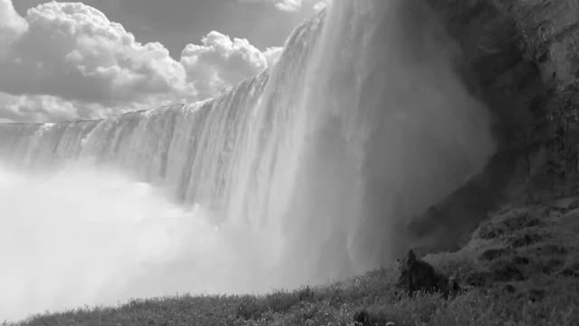
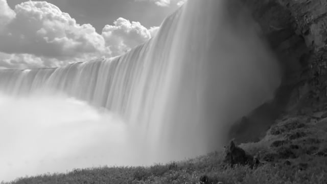

# Creating the misty water effect

Date: Sept. 8th, 2022  

In this tutorial, we will create the misty water effect, a stylistic photography effect that processes moving water look soft and flowing. For example, let's compare an original single image of the [Great Gorge](https://www.niagarafallstourism.com/play/outdoor-recreation/white-water-walk/) near [Niagara Falls](https://www.niagaraparks.com) with another image taken from the same location that has the misty water effect applied:


The misty water effect can be created by taking a burst of (usually) 20+ images, and then doing a per pixel average:


>   Suppose we have $K$ images that we want to merge into one misty effect image. Let $I_k$ represent the $k-th$ image, where $k \in \{1, …, K\}$. The resulting misty image can be determined by a per pixel, per colour channel averaging:

>
>$$
>   I_{\text{misty}} = \frac{1}{K}\large\sum_{k=1}^{K}I_k
>$$
>


The task of this activity is to complete the technique's implementation.

**Goals**: The goals of this activity are to: (1) overview of OpenCV in Python with respective to file I/O with images, (2) seeing
how images are represented as arrays, (3) comparing grayscale vs 3-channel colour images.

**Important**: You should be familiar (or make it a TODO) with creating and managing [conda](https://docs.conda.io/en/latest/) environments. conda is a great tool for helping us handle Python packages and their dependencies . Becoming familiar with it is a good investment for upcoming assignments. Follow the instructions [here](https://conda.io/projects/conda/en/latest/user-guide/install/download.html) for download, and these [docs](https://conda.io/projects/conda/en/latest/user-guide/tasks/manage-environments.html) for tips on environment creation/deletions.

## Getting started

Head into our project directory:

```
cd misty-water-effect
```

### Installation

Create a conda environment:
```
conda create -n misty python=3.10
conda activate misty
python -m pip install --upgrade pip
```

Install requirements:
```
python -m pip install -r requirements.txt
```

### Organization

>   Important: Everything you need to implement is in `main.py`, labeled with a `# TODO:`. You do not need to make any other changes.

`README.md`: final product, the TA demo version

`STUDENT.md`: student version, to be filled in by the student during tutorial

`main.py`: location where students should implement effect

`data/`: contains burst of images we will be merging into one misty effect image

`media/`: example figures for TA demo version

`scripts/`: contains helper scripts

`results/`: location students will write their images to


### Running
At this point, before we have implemented anything, you can try running the skeleton code with

```
python main.py
```
All that will be generated are black box placeholders, which can be found in STUDENT.md. Once something is implemented, try running `main.py` again.

**Note:** it could be possible that because of `PATH` issues, there is a redirect to an incorrect python version when running the above command. One example would be the command `python` starting up `python2.7` instead of `python3.7` despite being in the correct environment. This can cause issues with the OpenCV version for `python3.7`. It's possible to diagose this issue by running `which python` in your environment and checking that 
you are using the Python in said environment.

**Update:** some students have found that swapping out the command `python` for `python3` and `pip` for `pip3` may fix the issue above.

## Part A: Implementing the misty water effect on colour images

In this section, you will implement the following:

1. Image reading
2. Image writing
3. Array averaging across a specified axis

All of these implementations will go in the specified functions in `main.py`.
You only need to write code in locations that have been specified with a `#TODO:`.

### A.1: Reading and writing images: `read_im()` and `write_im()`

Implement the code needed for reading in an image in `read_im()` and writing in `write_im()`. Take a look at the [docs](https://docs.opencv.org/3.1.0/dc/d2e/tutorial_py_image_display.html) for help.

Once you finish implementing `read_im()` and `write_im()`, run `main.py`:

```
python main.py
```

After running, you should see an example original image we are working with here:


The image above is a single capture from a burst of images. Even though the water is moving very fast,
the image still retains a lot of detail and does not have that smooth effect we want to create.

### A.2: Generating a misty effect image by averaging across a specified axis: `calculate_misty()`

The general steps for creating a coloured misty water effect image are as follows:
1. Read in all images in burst. We need a lot of images (20+) to create a smooth effect. We assume that each image in burst has the same number of pixels and dimensions.
2. Stack all images into a single array such that the stack has dimensions (K, N, M, 3). Take a look at these [NumPy docs](https://numpy.org/doc/stable/reference/generated/numpy.stack.html) for hints on doing the stacking. Here, K is the number of images in our burst, N is the number of rows of pixels in each image, M is the number of colours of pixels. 3 represents our three colour channels RGB.
3. Average over dimension 0 (K) to get the misty image of size (N,M,3). The result will be the misty effect image


For this section, step 1 builds upon your `read_im()` implementation from [section A.1](#a1-reading-and-writing-images-read_im-and-write_im). Step 2 has already been implemented for you.
All that is needed to be done is step 3, the averaging in `calculate_misty()`. Take a look at these [NumPy docs](https://numpy.org/doc/stable/reference/generated/numpy.mean.html) for hints on doing the averaging

Once you finish implementing `read_im()` and `write_im()`, run `main.py` again:

```
python main.py
```

After running, you should see your misty image here:


Compared to the single capture from a burst of images in the [previous section](#topic-1-overview-of-opencv-in-python) the water looks much smoother, achieving the misty effect we wanted.

## Part B: Generating greyscale misty effect images

In the [previous section](#part-a-implementing-the-misty-water-effect-on-colour-images), we chose to manipulate the coloured (RGB) image. We can also choose to manipulate our image in greyscale.
All that is need to be done is a quick OpenCV flag switch in the reading process. Doing so, we can get a greyscale example original image:



Repeating the same exercise as before with generating the misty water effect on greyscale images (without writing extra code):


