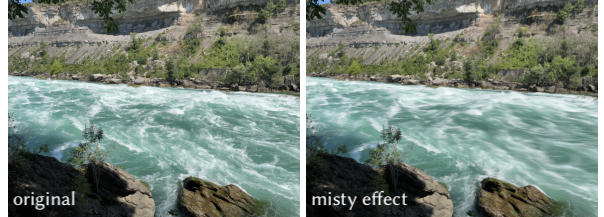

# Tutorial 1: Creating the misty water effect

Date: Sept. 8th, 2022  

In this tutorial, we will create the misty water effect, a photography style that makes moving water (or any moving fluid/cloud) look soft and flowing. For example, let's compare an original image of the [Great Gorge](https://www.niagarafallstourism.com/play/outdoor-recreation/white-water-walk/) near [Niagara Falls](https://www.niagaraparks.com) with another image taken from the same location with the misty water effect applied:

The misty water effect can be created by taking a burst of (usually) 20+ images, and then doing a per pixel average.

The students' task is to generate all of the figures needed for the visualizations.

### Organization

`README.md`: final product

`STUDENT.md`: student version, to be filled in

`data/`: contains images needed for tutorial

`media/`: example figures

`results/`: @students: empty directory for students to write to, need to be made

## Learning objectives

1. Overview of OpenCV in Python (reading & writing)
2. Representing images as arrays
3. Grayscale vs. 3-channel colour images

## Topic 1: Overview of OpenCV in Python
To read/write an image, take a look at the [docs](https://docs.opencv.org/3.1.0/dc/d2e/tutorial_py_image_display.html).

@student: load in one of the images in `data/` in colour.

This is the scene we're working with:

So far, the water has quite a bit of detail.

## Topic 2: Representing images as arrays

Now that we know how to read/write images with OpenCV, the next step is to investigate how images are represented: arrays. Each image can be considered an NxMx3 array, where

-   N: number of rows of pixels in the image
-   M: number of cols of pixels in the image
-   3: number of colour channels, in this case it is RGB

Q: What's the data type?

Q: What are the image dimensions?

Q: Which dimension/index does red correspond to? green?

The misty water effect can be generated with the following model:

>   Suppose we have $K$ images that we want to merge into one misty effect image. Let $I_k$ represent the $k$th image, where $k \in \{1, …, K\}$. The resulting misty image can be determined by a per pixel, per colour channel averaging:

>
>$$
>   I_{\text{misty}} = \frac{1}{K}\large\sum_{k=1}^{K}I_k
>$$
>

**Steps**
1. Read in all images in `data/`. We need a lot of images to create the effect
2. Stack all images into a single array such that the stack has dimensions (K, N, M, 3). Take a look at these [NumPy docs](https://numpy.org/doc/stable/reference/generated/numpy.stack.html) for hints on doing the stacking.
3. Average over dimension 0 (K) to get the misty image of size (N,M,3). Take a look at these [NumPy docs](https://numpy.org/doc/stable/reference/generated/numpy.mean.html) for hints on doing the averaging

@student: do the steps above
And so, the misty water effect image is:

## Topic 3: Grayscale vs. 3-channel colour images

We can also choose to read our images in greyscale:

Repeating the same exercise as before with generating the misty water effect:

